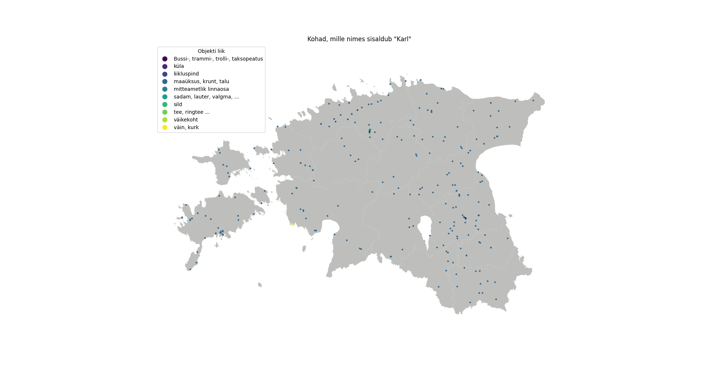

# \#30DayMapChallenge

[Learn more about the project](https://30daymapchallenge.com/)

### Days:
Every day has its own theme/category. For higher resolution, open image in new tab. Data used across multiple maps can be found in the common_data folder, map-specific data can be found together with its source code under src/{day number}.

1. Points

Data source: Maa-amet

2. Lines
3. Polygons
4. A bad map
5. Analog Map
6. Asia
7. Navigation
8. Africa
9. Hexagons
10. North America
11. Retro
12. South America
13. Choropleth
14. Europe
15. OpenStreetMap
16. Oceania
17. Flow
18. Atmosphere
19. 5-minute map
20. Outdoors
21. Raster
22. North is not always up
23. 3D
24. Black & white
25. Antarctica
26. Minimal
27. Dot
28. Is this a chart or a map?
29. Population
30. "My favorite.."